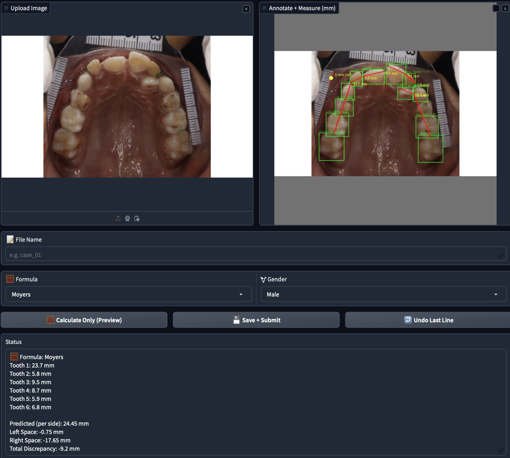

# 🦷 Dental Annotation Studio — YOLO + True Millimeter Mode



**Dental Annotation Studio** is an interactive Gradio-based system for dental space analysis, annotation, and measurement.  
It integrates **YOLO-based automatic tooth detection** with **manual calibration tools**, allowing clinicians and researchers to perform precise millimeter-level measurements directly from dental photographs or radiographs.

---

## 🚀 Features

- 🧠 **YOLO Integration** — Automatically detects teeth and marks bounding boxes on upload.  
- 📏 **True Millimeter Measurement Mode** — Calibrate real-world scale using a 5 mm reference line.  
- 📐 **Automatic Discrepancy Calculation** — Implements *Moyers* and *Tanaka–Johnston* formulas for space analysis.  
- 💬 **Interactive Gradio Interface** — Annotate, measure, undo, and save cases easily.  
- 💾 **Structured Saving System** — Saves original, resized, and annotated images, along with JSON metadata.  

---

## 🖼️ Example UI


```bash
assets/
└── ui_screenshot.png
```

Sample Preview:


---

## 🧩 Project Structure

```
dental-annotation/
│
├── app.py     # Main Gradio app with YOLO integration
├── best.pt                  # YOLO model weights
├── assets/
│   └── ui_screenshot.png    # UI preview image
├── saved_v18_mm/            # Automatically created folder for outputs
├── requirements.txt          # Dependencies (optional)
└── README.md
```

---

## ⚙️ Installation

### 1️⃣ Clone the Repository
```bash
git clone https://github.com/Sandeep-4469/dental-annotation.git
cd dental-annotation
```

### 2️⃣ Create & Activate Virtual Environment
```bash
python3 -m venv env
source env/bin/activate
```

### 3️⃣ Install Dependencies
```bash
pip install -r requirements.txt
```

If you don’t have a `requirements.txt`, use:
```bash
pip install gradio ultralytics opencv-python pillow numpy
```

---

## ▶️ Run the Application

```bash
python dental_annotation.py
```

The app launches locally at:
```
http://0.0.0.0:7860
```

When launched with `share=True`, a public link is generated for remote access.

---

## 🧮 Core Workflow

| Step | Description |
|------|--------------|
| **1. Upload Image** | Choose a dental photo or radiograph. YOLO automatically detects teeth and shows bounding boxes. |
| **2. Calibrate** | Draw a reference 5 mm line for scale calibration. |
| **3. Measure** | Draw measurement lines across teeth or spaces. |
| **4. Compute Discrepancy** | Automatically apply Moyers or Tanaka–Johnston formula. |
| **5. Save & Export** | The app saves results (original, annotated, JSON). |

---

## 📊 Output Structure

Each saved case contains:
```
saved_v18_mm/
├── original/case_01.jpg
├── resized/case_01.jpg
├── annotated/case_01.jpg
└── annotations.json
```

`annotations.json` includes:
```json
{
  "case_01": {
    "formula": "Moyers",
    "gender": "Male",
    "pixel_per_mm": 18.72,
    "segments": [
      {"p1": [x1, y1], "p2": [x2, y2], "mm": 5.0},
      {"p1": [x3, y3], "p2": [x4, y4], "mm": 8.3}
    ],
    "discrepancy_mm": {
      "predicted_mm_per_side": 21.4,
      "left_space_mm": -2.1,
      "right_space_mm": -1.8,
      "discrepancy_mm": -1.95
    }
  }
}
```

---

## 🧠 Model

The YOLO model (`best.pt`) is trained on annotated dental images for tooth localization.  
You can retrain it using the **Ultralytics YOLOv8** framework.

```bash
yolo train model=yolov8n.pt data=dental.yaml epochs=100 imgsz=640
```

---

## 🧾 Citations

If you use this tool in your research, please cite:

```
@software{dental_annotation_2025,
  author = {Vissapragada, Sandeep},
  title = {Dental Annotation Studio: YOLO-powered Millimeter Measurement Tool},
  year = {2025},
  url = {https://github.com/Sandeep-4469/dental-annotation}
}
```

---

## 🙌 Acknowledgements

- **YOLOv8** — Ultralytics  
- **Gradio** — For rapid UI prototyping  
- **OpenCV / Pillow** — For image manipulation  
- **Moyers and Tanaka–Johnston** — Standard orthodontic prediction models  

---

## 👨‍💻 Author

**Sandeep Vissapragada**  
M.Tech, IIT Bhilai  
📧 sandeepvissa2002@gmail.com  
🔗 [GitHub: Sandeep-4469](https://github.com/Sandeep-4469)

---

## ⭐ Contribute

Feel free to open issues or pull requests to improve performance, UI, or clinical validation.

```bash
git pull
git checkout -b feature/improvement
git commit -m "Enhanced ROI measurement pipeline"
git push origin feature/improvement
```
